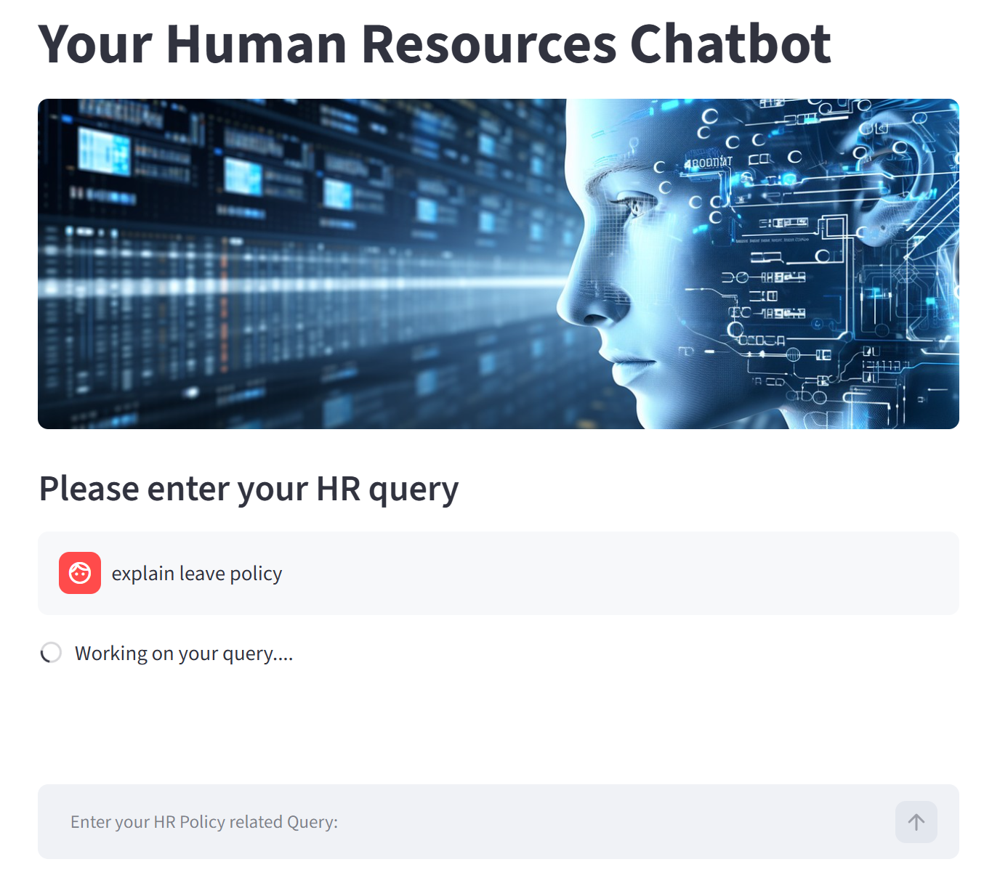
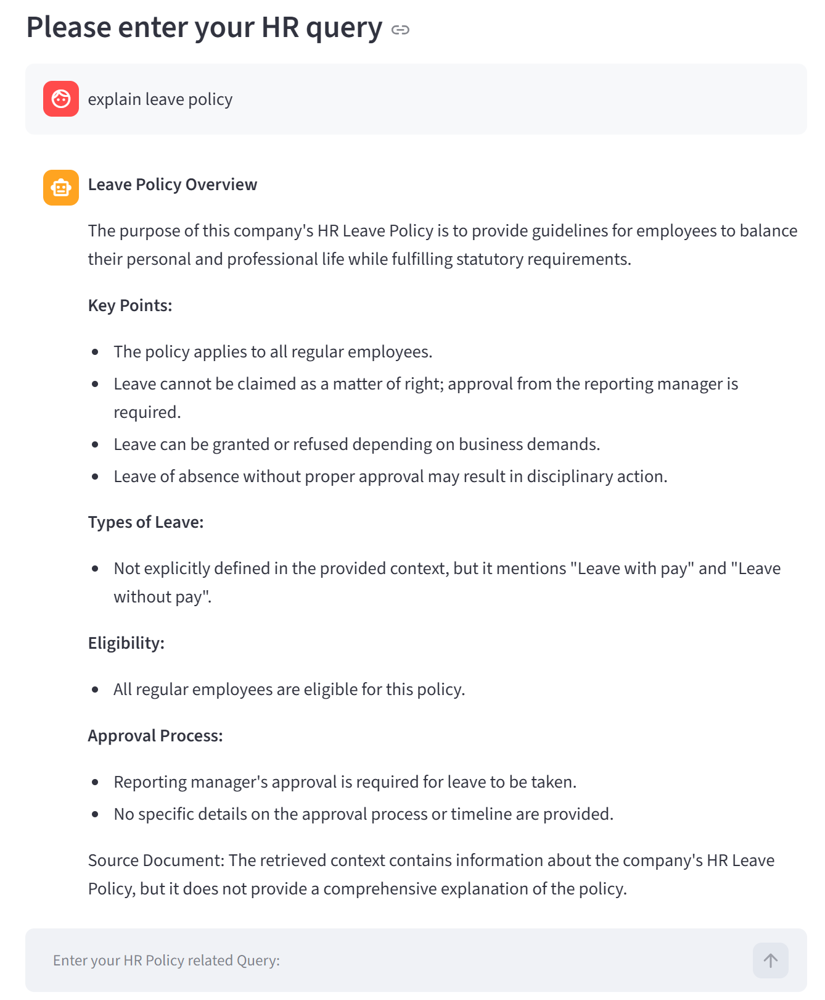
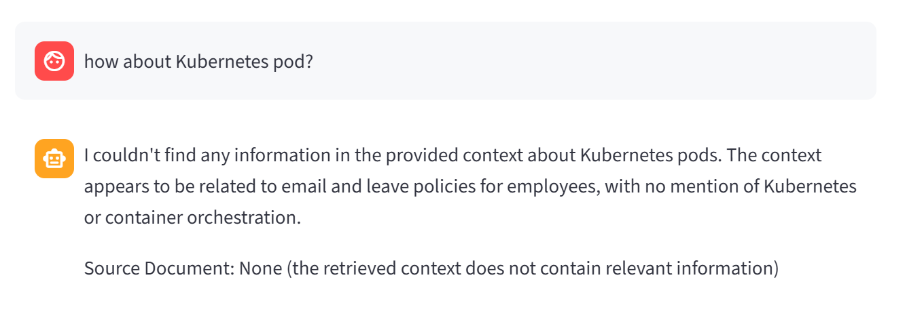
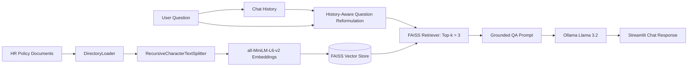

# HR Policy Chatbot — Conversational RAG with LangChain, FAISS, Ollama & Streamlit


## Overview

The **HR Policy Chatbot** is a local Retrieval-Augmented Generation (RAG) application that answers employee questions using an HR policy knowledge base. Instead of relying on the LLM's general knowledge, the application retrieves relevant policy passages from a FAISS vector index and instructs the model to answer only from the retrieved context.

The project demonstrates an end-to-end RAG workflow:

**HR policy documents → data collection → filtering and cleaning → document loading → chunking → embeddings → FAISS → semantic retrieval → history-aware question reformulation → LLM answer generation → Streamlit chat UI**

> **Data source:** HR policy pages collected from the public HR Help Board website. See the **Data Source and Preparation** section below for reproducible download and cleaning instructions.

## Demo

### Streamlit application UI

The chatbot is served through a Streamlit interface. Users can enter HR-policy-related questions directly in the chat input.



### Example 1 — HR policy question

The chatbot retrieves relevant HR policy context and generates a concise answer grounded in the retrieved documents.



### Example 2 — Out-of-scope question

When the user asks about a topic outside the HR policy corpus, the chatbot avoids making up an answer and responds that the retrieved context does not contain relevant information.



## Key Features

- Semantic search over HR policy documents
- Local vector database using FAISS
- Local embeddings with `sentence-transformers/all-MiniLM-L6-v2`
- Local LLM inference with Ollama and `llama3.2:latest`
- History-aware retrieval for follow-up questions
- Grounded prompting to reduce hallucination
- Top-k retrieval (`k=3`)
- Streamlit conversational interface
- Cached model and vector-store loading for faster reruns
- Explicit fallback when relevant information is unavailable

## Architecture



## Data Source and Preparation

The HR policy knowledge base is collected from publicly available HR policy pages on HR Help Board.

### Download the source documents

Create the local HR policy corpus by running:

```bash
wget -r -A.html -P hr-policies https://www.hrhelpboard.com/hr-policies.html
```

This command recursively downloads HTML pages into the `hr-policies/` directory, which is used as the input directory for the document ingestion pipeline.

> The download step performs **data collection only**. The downloaded website content should be reviewed and cleaned before building the vector index.

### Data Cleaning

A recursive website download may include pages that are not directly relevant to HR policy question answering. Before running the embedding and indexing pipeline, review the downloaded corpus and remove irrelevant or noisy content such as:

- Job postings and recruitment advertisements
- Cover letters and letter templates
- General HR articles and blog posts
- Career advice pages
- Duplicate pages
- Navigation or index pages with little policy content
- Other pages that do not contain actionable HR policy information

The goal is to keep the RAG knowledge base focused on policy-related content. Removing irrelevant documents reduces retrieval noise and increases the probability that the retriever returns useful context for HR policy questions.

After cleaning, the prepared documents should remain under:

```text
hr-policies/
├── leave-policy.html
├── employee-onboarding-policy.html
├── attendance-policy.html
├── code-of-conduct.html
└── ...
```

The complete data preparation and indexing flow is:

```text
Public HR Policy Website
        ↓
Recursive HTML Collection
        ↓
Filtering and Cleaning
        ↓
Document Loading
        ↓
Text Chunking
        ↓
Embedding Generation
        ↓
FAISS Vector Index
```

> **Data usage note:** Source website content belongs to its respective owner. Review the website's terms of use and content license before redistributing downloaded documents. The repository can provide reproducible collection and preparation instructions without committing the downloaded source corpus itself.

## RAG Workflow

### 1. Data ingestion and indexing

`hrpc-FAISS-upload.py` loads documents from the `hr-policies/` directory, splits them into overlapping chunks, converts the chunks into dense vector embeddings, and stores them in a local FAISS index.

Current chunking configuration:

- Chunk size: `500`
- Chunk overlap: `50`
- Embedding model: `sentence-transformers/all-MiniLM-L6-v2`

### 2. Retrieval

At query time, the application embeds the user question and retrieves the three most semantically similar chunks from FAISS.

### 3. Conversational RAG

The chatbot uses a history-aware retriever. If a user asks a follow-up question such as *“How many days?”*, the model first reformulates it into a standalone question using the previous conversation before retrieval.

### 4. Grounded answer generation

The QA prompt instructs the model to:

- answer only from retrieved HR policy context;
- clearly identify partial information;
- avoid using unsupported general knowledge;
- return a fixed fallback message when no relevant information is found;
- keep answers concise;
- mention the source document when available.

## Project Structure

```text
hr-policy-chatbot/
├── hr-policies/              # Downloaded and cleaned HR policy documents
├── faiss_index/              # Generated local FAISS index
├── banner-AI.png             # Streamlit UI banner
├── image(119).png            # Demo screenshot: Streamlit UI
├── image(120).png            # Demo screenshot: HR policy answer
├── image(121).png            # Demo screenshot: out-of-scope answer
├── hrpc-FAISS-upload.py      # Ingestion, chunking, embedding, indexing
├── hrpc-query.py             # Conversational RAG chain and Streamlit UI
├── requirements.txt
├── .gitignore
└── README.md
```

> The `hr-policies/` corpus and generated `faiss_index/` may be excluded from Git version control. They can be recreated locally from the data preparation and indexing steps.

## Tech Stack

| Component | Technology |
|---|---|
| Language | Python |
| RAG framework | LangChain |
| Embedding model | sentence-transformers/all-MiniLM-L6-v2 |
| Vector database | FAISS |
| LLM runtime | Ollama |
| LLM | llama3.2:latest |
| User interface | Streamlit |

## Getting Started

### Prerequisites

- Python 3.10+
- `wget`
- Ollama installed and running
- `llama3.2:latest` available locally

### Installation

```bash
git clone <YOUR_GITHUB_REPOSITORY_URL>
cd hr-policy-chatbot

python -m venv .venv

# Windows
.venv\Scripts\activate

# macOS/Linux
source .venv/bin/activate

pip install -r requirements.txt
```

Pull the local model:

```bash
ollama pull llama3.2
```

### 1. Build the FAISS index

In `hrpc-FAISS-upload.py`, call `upload_htmls()` in the main block, then run:

```bash
python hrpc-FAISS-upload.py
```

After the index has been created, avoid rebuilding it on every application run. Rebuild the index when the source corpus changes.

### 2. Run the chatbot

```bash
streamlit run hrpc-query.py
```

## Example Questions

- How many paid leave days do employees receive?
- Explain the candidate onboarding process.
- What is the policy for parental leave?
- Can employees carry unused leave into the next year?
- What documents are required during onboarding?

## Testing Strategy

The system should be evaluated across four categories: direct factual questions, paraphrased questions, conversational follow-ups, and out-of-scope questions. Evaluation should inspect both retrieval relevance and final-answer groundedness.

Suggested metrics:

- Retrieval relevance / Precision@k
- Faithfulness to retrieved context
- Answer correctness
- Source attribution quality
- End-to-end latency

> The current repository demonstrates the RAG workflow, but it does not yet include an automated evaluation pipeline or benchmark dataset.

## Current Limitations

- FAISS is local and not designed here for distributed multi-user serving.
- Retrieval uses fixed top-k similarity search without reranking.
- No metadata filtering is currently implemented.
- Source attribution depends on metadata and prompt compliance rather than structured citation rendering.
- The application does not yet include automated RAG evaluation.
- Local Ollama inference performance depends on the user's CPU/GPU and available memory.
- The FAISS load call enables dangerous deserialization; only load indexes you created or fully trust.
- Data cleaning is currently a manual preprocessing step.
- **Policy freshness:** The current FAISS index represents a snapshot of the HR policy documents at ingestion time. If the source website updates a policy, the chatbot may continue returning outdated information until the knowledge base is refreshed. A future solution is to add a scheduled or change-triggered ingestion pipeline that re-collects source pages, detects updated documents, cleans and validates the content, regenerates affected embeddings, and updates or rebuilds the vector index.

## Roadmap

- Automate URL filtering and document cleaning
- Add a labeled HR-policy evaluation set
- Add reranking with a cross-encoder
- Add metadata filters for policy category and document version
- Return structured source citations in the UI
- Containerize with Docker
- Deploy a cloud version using managed object storage and a production vector database
- Add logging, tracing, latency monitoring, and feedback collection

## License

No license
